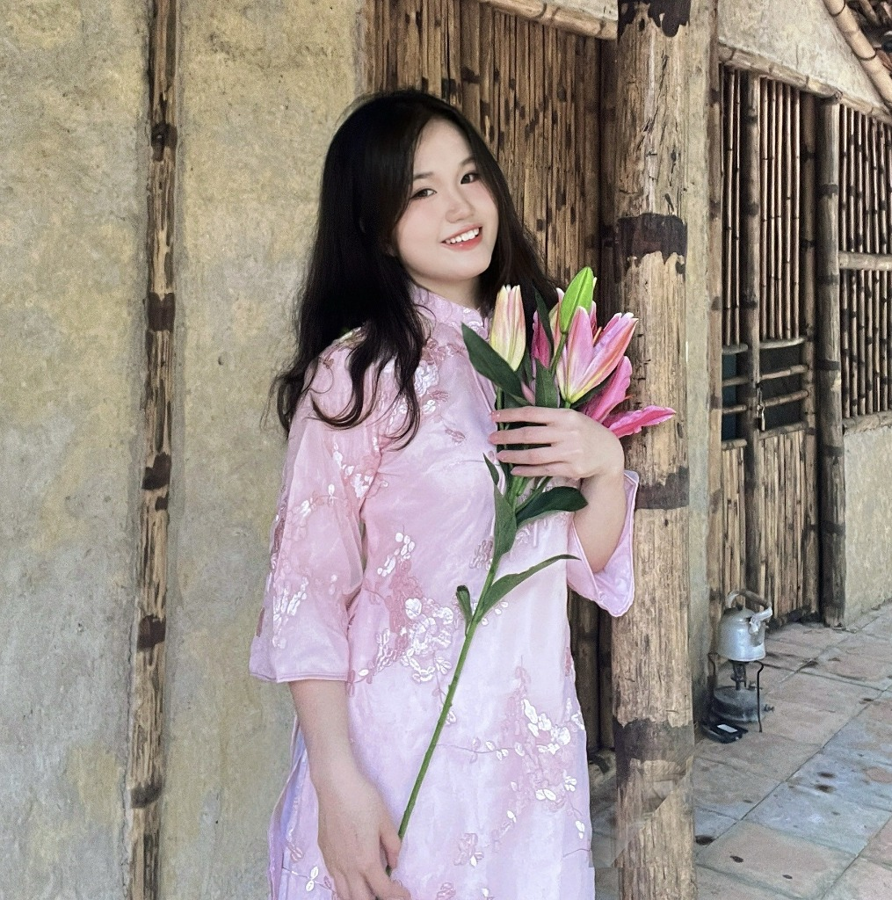

<!DOCTYPE html>
<html lang="vi">
<head>
  <meta charset="UTF-8" />
  <meta name="viewport" content="width=device-width, initial-scale=1.0" />
  <title>Nguyễn Thu Hương – Portfolio</title>
  <meta name="description" content="Portfolio cá nhân của Nguyễn Thu Hương – Sinh viên Kinh tế Quốc tế tại Đại học Ngoại Thương, đam mê kinh doanh, tài chính và hợp tác quốc tế." />
  <link rel="preconnect" href="https://fonts.googleapis.com" />
  <link rel="preconnect" href="https://fonts.gstatic.com" crossorigin />
  <link href="https://fonts.googleapis.com/css2?family=Cormorant+Garamond:ital,wght@0,300;0,400;0,500;0,600;1,300;1,400&family=DM+Sans:wght@300;400;500;600&family=Playfair+Display:ital,wght@0,400;0,700;1,400&display=swap" rel="stylesheet" />
  <link rel="stylesheet" href="style.css" />
</head>
<body>
  <!-- Canvas for butterflies & petals -->
  <canvas id="bgCanvas"></canvas>
  <!-- Navigation -->
  <nav id="navbar">
    

      <a class="nav-logo" href="#hero">Thu Hương</a>
      <ul class="nav-links">
        <li><a href="#about">Về tôi</a></li>
        <li><a href="#education">Học vấn</a></li>
        <li><a href="#leadership">Hoạt động</a></li>
        <li><a href="#skills">Kỹ năng</a></li>
        <li><a href="#contact">Liên hệ</a></li>
      </ul>
      <button class="hamburger" id="hamburger" aria-label="Menu">
        
      </button>
    

  </nav>
  <!-- Mobile menu -->
  

    <ul>
      <li><a href="#about" onclick="closeMobile()">Về tôi</a></li>
      <li><a href="#education" onclick="closeMobile()">Học vấn</a></li>
      <li><a href="#leadership" onclick="closeMobile()">Hoạt động</a></li>
      <li><a href="#skills" onclick="closeMobile()">Kỹ năng</a></li>
      <li><a href="#contact" onclick="closeMobile()">Liên hệ</a></li>
    </ul>
  

  <!-- HERO -->
  <section id="hero">
    

      

        
        
NTH

        

        

      

      

        
Xin chào, tôi là

        <h1 class="hero-name">Nguyễn Thu Hương</h1>
        
International Economics Student · External Relations · Future Finance Professional

        
"Growth comes from continuous learning, meaningful experiences, and the courage to take on new challenges."

        

          <a href="#about" class="btn-primary" id="btn-explore">Khám phá</a>
          <a href="#contact" class="btn-ghost" id="btn-contact">Liên hệ tôi</a>
        

        

          🎓 FTU
          🌐 IELTS 7.0
          📌 Hà Nội
        

      

    

    

      Cuộn xuống
      

    

  </section>
  <!-- ABOUT -->
  <section id="about">
    

      
01 — Về Tôi

      <h2 class="section-title">Giới Thiệu Bản Thân</h2>
      

        

          

            Tôi là <strong>Nguyễn Thu Hương</strong>, sinh viên năm ba Chương trình Chất lượng cao ngành Kinh tế Quốc tế tại Đại học Ngoại Thương (FTU). Tôi có niềm đam mê mạnh mẽ với kinh tế, kinh doanh quốc tế và tài chính — đặc biệt là phát triển kinh doanh, quan hệ đối tác chiến lược và phát triển bền vững.
          

          

            Thông qua các vai trò lãnh đạo trong tổ chức sinh viên và nhiều năm kinh nghiệm giảng dạy, tôi đã phát triển kỹ năng giao tiếp, làm việc nhóm, giải quyết vấn đề và tổ chức sự kiện.
          

          

            Hiện tại tôi đang tìm kiếm cơ hội thực tập để áp dụng kiến thức học thuật, tích lũy kinh nghiệm thực tiễn và đóng góp vào môi trường làm việc chuyên nghiệp.
          

          <a href="#contact" class="btn-primary" style="margin-top:1.5rem;display:inline-block;" id="btn-about-contact">Kết nối với tôi</a>
        

        

          

            
Họ và tênNguyễn Thu Hương

            
Ngày sinh19/01/2005

            
TrườngĐại học Ngoại Thương (FTU)

            
Chương trìnhKinh tế Quốc tế CLC

            
Năm họcNăm 3

            
IELTS7.0

            
Điện thoại0912 302 262

            
Địa điểmHà Nội, Việt Nam

          

        

      

    

  </section>
  <!-- EDUCATION -->
  <section id="education" class="alt-bg">
    

      
02 — Học Vấn

      <h2 class="section-title">Hành Trình Học Tập</h2>
      

        

          

          

            
2023 – Nay

            <h3 class="timeline-school">Đại học Ngoại Thương (FTU)</h3>
            
Chương trình Chất lượng cao – Kinh tế Quốc tế

            

              Kinh tế Quốc tế
              Thương mại Quốc tế
              Tài chính Doanh nghiệp
              Phân tích BCTC
              Kinh tế Lượng
              Kinh tế Khu vực
              Kinh doanh Quốc tế
            

          

        

        

          

          

            
2020 – 2023

            <h3 class="timeline-school">THPT Chuyên Biên Hòa</h3>
            
Chuyên Toán

            
Tích cực tham gia các tổ chức học sinh và các dự án môi trường, phát triển kỹ năng lãnh đạo và gắn kết cộng đồng song song với thành tích học tập xuất sắc.

          

        

      

    

  </section>
  <!-- LEADERSHIP & ACTIVITIES -->
  <section id="leadership">
    

      
03 — Hoạt Động

      <h2 class="section-title">Lãnh Đạo & Ngoại Khóa</h2>
      

        

          
🌐

          
Hiện tại

          <h3>Phó Trưởng Ban Đối Ngoại</h3>
          
Global Economic Club (GEC) – FTU

          
2025 – Nay

          <ul class="act-list">
            <li>Xây dựng và duy trì quan hệ với nhà tài trợ và đối tác bên ngoài</li>
            <li>Tham gia đề xuất tài trợ và đàm phán hợp tác</li>
            <li>Hỗ trợ gây quỹ và phối hợp tổ chức sự kiện</li>
          </ul>
        

        

          
👑

          
Hiện tại

          <h3>Chủ Tịch Hội Sinh Viên</h3>
          
A06 – Kinh tế Quốc tế CLC – FTU

          
2023 – Nay

          <ul class="act-list">
            <li>Lãnh đạo các hoạt động phúc lợi sinh viên và xây dựng cộng đồng</li>
            <li>Điều phối các sáng kiến tình nguyện và xã hội</li>
            <li>Tăng cường sự tham gia và hợp tác của sinh viên</li>
          </ul>
        

        

          
📋

          
Hiện tại

          <h3>Phó Bí Thư Chi Đoàn</h3>
          
A06 – Kinh tế Quốc tế CLC – FTU

          
2023 – Nay

          <ul class="act-list">
            <li>Điều phối hoạt động lớp và chương trình gắn kết sinh viên</li>
            <li>Hỗ trợ kết nối giữa sinh viên và giảng viên</li>
            <li>Tổ chức các sự kiện học thuật và ngoại khóa</li>
          </ul>
        

        

          
🤝

          
2024–2025

          <h3>Thành Viên Ban Đối Ngoại</h3>
          
Global Economic Club (GEC) – FTU

          
2024 – 2025

          <ul class="act-list">
            <li>Hỗ trợ tiếp cận nhà tài trợ và phát triển đối tác</li>
            <li>Hỗ trợ truyền thông với tổ chức bên ngoài</li>
            <li>Đóng góp lập kế hoạch và thực thi sự kiện</li>
          </ul>
        

        

          
🌿

          
2023

          <h3>Phó Chủ Tịch CLB Lãnh Đạo Môi Trường</h3>
          
THPT Chuyên Biên Hòa

          
2023

          <ul class="act-list">
            <li>Phối hợp các chiến dịch nâng cao nhận thức môi trường</li>
            <li>Quản lý dự án câu lạc bộ và hoạt động thành viên</li>
            <li>Tổ chức các sáng kiến môi trường toàn trường</li>
          </ul>
        

        

          
🎯

          
2022

          <h3>Trưởng Ban Hành Động</h3>
          
CLB Lãnh Đạo Môi Trường – THPT Chuyên Biên Hòa

          
2022

          <ul class="act-list">
            <li>Dẫn dắt hoạt động tình nguyện và dự án môi trường</li>
            <li>Điều phối triển khai chiến dịch và hậu cần</li>
            <li>Phối hợp với các ban để đạt mục tiêu dự án</li>
          </ul>
        

      

    

  </section>
  <!-- TEACHING -->
  <section id="teaching" class="alt-bg">
    

      
04 — Kinh Nghiệm

      <h2 class="section-title">Kinh Nghiệm Giảng Dạy</h2>
      

        
📚

        

          <h3>Gia Sư Cá Nhân</h3>
          
2022 – Hiện tại &nbsp;|&nbsp; Hơn 3 năm kinh nghiệm

          

            

              
Trách nhiệm

              <ul>
                <li>Xây dựng kế hoạch học tập cá nhân hóa</li>
                <li>Hỗ trợ học sinh cải thiện kết quả học tập</li>
                <li>Tăng cường sự tự tin và động lực học tập</li>
                <li>Giao tiếp hiệu quả với học sinh và phụ huynh</li>
              </ul>
            

            

              
Kỹ năng phát triển

              

                Giao tiếp
                Thuyết trình
                Lãnh đạo
                Kiên nhẫn
                Quản lý thời gian
                Giải quyết vấn đề
              

            

          

        

      

    

  </section>
  <!-- SKILLS -->
  <section id="skills">
    

      
05 — Kỹ Năng

      <h2 class="section-title">Năng Lực Cốt Lõi</h2>
      

        

          
💼

          <h3>Kỹ năng Chuyên môn</h3>
          

            
Giao tiếp & PR

            
Đàm phán

            
Lãnh đạo

            
Làm việc nhóm

            
Tổ chức sự kiện

            
Quản lý thời gian

          

        

        

          
💻

          <h3>Kỹ năng Kỹ thuật</h3>
          

            
📊Microsoft Excel

            
📝Microsoft Word

            
📽PowerPoint

            
☁️Google Workspace

            
🎨Canva

            
🔍Internet Research

            
📈Phân tích Dữ liệu cơ bản

          

        

        

          
🌏

          <h3>Ngôn ngữ</h3>
          

            

              
🇻🇳

              

                
Tiếng Việt

                
Bản ngữ

                

              

            

            

              
🇬🇧

              

                
Tiếng Anh

                
IELTS 7.0 – Thành thạo

                

              

            

          

        

      

    

  </section>
  <!-- ACHIEVEMENTS -->
  <section id="achievements" class="alt-bg">
    

      
06 — Thành Tích

      <h2 class="section-title">Những Dấu Ấn Nổi Bật</h2>
      

        

          
01

          

            <h3>IELTS Overall Band Score 7.0</h3>
            
Đạt trình độ tiếng Anh nâng cao, đáp ứng yêu cầu môi trường quốc tế chuyên nghiệp.

          

        

        

          
02

          

            <h3>Phó Trưởng Ban Đối Ngoại – GEC</h3>
            
Đảm nhận vai trò lãnh đạo trong câu lạc bộ uy tín nhất tại FTU về quan hệ đối ngoại.

          

        

        

          
03

          

            <h3>Chủ Tịch Hội Sinh Viên A06</h3>
            
Lãnh đạo và gắn kết cộng đồng sinh viên trong chương trình quốc tế chất lượng cao.

          

        

        

          
04

          

            <h3>Phó Chủ Tịch CLB Môi Trường (ELC)</h3>
            
Dẫn dắt các chiến dịch bảo vệ môi trường quy mô toàn trường tại THPT Chuyên Biên Hòa.

          

        

        

          
05

          

            <h3>Hơn 3 năm kinh nghiệm Gia Sư</h3>
            
Xây dựng kỹ năng giao tiếp, lãnh đạo và giải quyết vấn đề qua thực tiễn giảng dạy.

          

        

      

    

  </section>
  <!-- CAREER OBJECTIVE -->
  <section id="career">
    

      
07 — Mục Tiêu

      <h2 class="section-title">Định Hướng Sự Nghiệp</h2>
      

        
"

        

          Là sinh viên Kinh tế Quốc tế, tôi hướng tới xây dựng sự nghiệp trong lĩnh vực <strong>kinh doanh, tài chính, thương mại quốc tế hoặc quan hệ doanh nghiệp</strong>. Tôi mong muốn tích lũy kinh nghiệm thực tiễn qua các cơ hội thực tập, nơi tôi có thể đóng góp kỹ năng giao tiếp, lãnh đạo và phân tích, đồng thời không ngừng phát triển chuyên môn.
        

        

          🏦 Tài chính
          🌐 Thương mại Quốc tế
          📊 Kinh doanh
          🤝 Quan hệ Doanh nghiệp
          🌱 Phát triển Bền vững
        

      

    

  </section>
  <!-- CONTACT -->
  <section id="contact" class="alt-bg">
    

      
08 — Liên Hệ

      <h2 class="section-title">Kết Nối Với Tôi</h2>
      
Tôi luôn mở cửa cho các cơ hội thực tập, hợp tác và kết nối chuyên nghiệp. Hãy liên hệ với tôi!

      

        <a href="tel:0912302262" class="contact-card" id="cc-phone">
          
📞

          
Điện thoại

          
0912 302 262

        </a>
        <a href="mailto:nguyenthuhuong.19012005@gmail.com" class="contact-card" id="cc-email">
          
📧

          
Email

          
nguyenthuhuong.19012005@gmail.com

        </a>
        <a href="https://www.linkedin.com/in/h%C6%B0%C6%A1ng-nguy%E1%BB%85n-0a07001b5/" target="_blank" rel="noopener" class="contact-card" id="cc-linkedin">
          
💼

          
LinkedIn

          
Nguyễn Hương

        </a>
        

          
📍

          
Địa điểm

          
Hà Nội, Việt Nam

        

      

    

  </section>
  <!-- FOOTER -->
  <footer>
    
© 2025 Nguyễn Thu Hương · Được tạo với ❤️ · FTU International Economics

  </footer>
  
</body>
</html>

/* =============================================
   SCRIPT.JS – ANIMATIONS, CANVAS, INTERACTIONS
   ============================================= */
/* ---- NAVBAR SCROLL ---- */
const navbar = document.getElementById('navbar');
window.addEventListener('scroll', () => {
  navbar.classList.toggle('scrolled', window.scrollY > 40);
});
/* ---- HAMBURGER MENU ---- */
const hamburger = document.getElementById('hamburger');
const mobileMenu = document.getElementById('mobileMenu');
hamburger.addEventListener('click', () => {
  mobileMenu.classList.toggle('open');
});
function closeMobile() {
  mobileMenu.classList.remove('open');
}
/* ---- SMOOTH ACTIVE NAV ---- */
const sections = document.querySelectorAll('section[id]');
const navLinks = document.querySelectorAll('.nav-links a');
window.addEventListener('scroll', () => {
  let current = '';
  sections.forEach(sec => {
    if (window.scrollY >= sec.offsetTop - 120) current = sec.getAttribute('id');
  });
  navLinks.forEach(a => {
    a.style.color = a.getAttribute('href') === `#${current}` ? 'var(--pink-500)' : '';
  });
});
/* ---- REVEAL ON SCROLL ---- */
const reveals = document.querySelectorAll('.activity-card, .skill-category, .achievement-item, .timeline-item, .contact-card, .about-grid, .teaching-card, .career-card');
reveals.forEach(el => el.classList.add('reveal'));
const revealObserver = new IntersectionObserver((entries) => {
  entries.forEach((entry, i) => {
    if (entry.isIntersecting) {
      setTimeout(() => {
        entry.target.classList.add('visible');
      }, (entry.target.dataset.delay || 0) * 80);
      revealObserver.unobserve(entry.target);
    }
  });
}, { threshold: 0.12 });
reveals.forEach((el, i) => {
  el.dataset.delay = i % 4;
  revealObserver.observe(el);
});
/* ---- SKILL BARS ANIMATION ---- */
const barObserver = new IntersectionObserver((entries) => {
  entries.forEach(entry => {
    if (entry.isIntersecting) {
      entry.target.querySelectorAll('.bar-fill').forEach(fill => {
        const pct = fill.dataset.pct;
        fill.style.width = pct + '%';
      });
      barObserver.unobserve(entry.target);
    }
  });
}, { threshold: 0.3 });
document.querySelectorAll('.skill-category').forEach(el => barObserver.observe(el));
/* ================================================================
   CANVAS – BUTTERFLIES & FALLING PETALS
   ================================================================ */
const canvas = document.getElementById('bgCanvas');
const ctx = canvas.getContext('2d');
function resizeCanvas() {
  canvas.width = window.innerWidth;
  canvas.height = window.innerHeight;
}
resizeCanvas();
window.addEventListener('resize', resizeCanvas);
/* ---- BUTTERFLY CLASS ---- */
class Butterfly {
  constructor() { this.reset(true); }
  reset(initial = false) {
    this.x = Math.random() * canvas.width;
    this.y = initial ? Math.random() * canvas.height : -60;
    this.size = 18 + Math.random() * 22;
    this.speed = 0.25 + Math.random() * 0.35;
    this.angle = Math.random() * Math.PI * 2;
    this.angleSpeed = (Math.random() - 0.5) * 0.012;
    this.waveAmp = 40 + Math.random() * 60;
    this.waveFreq = 0.008 + Math.random() * 0.012;
    this.wingPhase = Math.random() * Math.PI * 2;
    this.wingSpeed = 0.06 + Math.random() * 0.06;
    this.opacity = 0.12 + Math.random() * 0.22;
    this.hue = 320 + Math.random() * 40; // pink range
    this.startX = this.x;
    this.t = 0;
    this.driftX = (Math.random() - 0.5) * 0.4;
  }
  update() {
    this.t += 1;
    this.wingPhase += this.wingSpeed;
    this.angle += this.angleSpeed;
    this.x = this.startX + Math.sin(this.t * this.waveFreq) * this.waveAmp + this.driftX * this.t;
    this.y += this.speed;
    if (this.y > canvas.height + 80) this.reset();
  }
  draw() {
    ctx.save();
    ctx.globalAlpha = this.opacity;
    ctx.translate(this.x, this.y);
    ctx.rotate(this.angle);
    const wingFlap = Math.sin(this.wingPhase);
    const s = this.size;
    // Draw butterfly wings using bezier curves
    const drawWing = (mirror) => {
      ctx.save();
      if (mirror) ctx.scale(-1, 1);
      // Upper wing
      ctx.beginPath();
      ctx.moveTo(0, 0);
      ctx.bezierCurveTo(
        s * wingFlap * 1.2, -s * 0.8,
        s * 1.5 * wingFlap, -s * 0.4,
        s * 0.8 * wingFlap, s * 0.3
      );
      ctx.bezierCurveTo(
        s * 0.4 * wingFlap, s * 0.6,
        0, s * 0.3,
        0, 0
      );
      const grad = ctx.createRadialGradient(s * 0.5 * wingFlap, -s * 0.3, 0, s * 0.5 * wingFlap, -s * 0.3, s * 1.2);
      grad.addColorStop(0, `hsla(${this.hue}, 80%, 75%, 0.9)`);
      grad.addColorStop(0.5, `hsla(${this.hue + 15}, 70%, 82%, 0.7)`);
      grad.addColorStop(1, `hsla(${this.hue}, 60%, 90%, 0.2)`);
      ctx.fillStyle = grad;
      ctx.fill();
      // Lower wing
      ctx.beginPath();
      ctx.moveTo(0, 0);
      ctx.bezierCurveTo(
        s * 0.9 * wingFlap, s * 0.4,
        s * 0.9 * wingFlap, s * 0.9,
        s * 0.2 * wingFlap, s * 0.9
      );
      ctx.bezierCurveTo(
        -s * 0.1, s * 0.8,
        0, s * 0.5,
        0, 0
      );
      const grad2 = ctx.createRadialGradient(s * 0.4 * wingFlap, s * 0.6, 0, s * 0.4 * wingFlap, s * 0.6, s * 0.9);
      grad2.addColorStop(0, `hsla(${this.hue + 20}, 75%, 78%, 0.85)`);
      grad2.addColorStop(1, `hsla(${this.hue}, 65%, 88%, 0.15)`);
      ctx.fillStyle = grad2;
      ctx.fill();
      ctx.restore();
    };
    drawWing(false);
    drawWing(true);
    // Body
    ctx.beginPath();
    ctx.ellipse(0, s * 0.3, 1.5, s * 0.55, 0, 0, Math.PI * 2);
    ctx.fillStyle = `hsla(${this.hue - 20}, 60%, 40%, 0.7)`;
    ctx.fill();
    // Antennae
    ctx.strokeStyle = `hsla(${this.hue - 20}, 60%, 40%, 0.5)`;
    ctx.lineWidth = 0.8;
    ctx.beginPath();
    ctx.moveTo(0, -s * 0.1);
    ctx.quadraticCurveTo(-s * 0.3, -s * 0.8, -s * 0.5, -s * 0.9);
    ctx.stroke();
    ctx.beginPath();
    ctx.moveTo(0, -s * 0.1);
    ctx.quadraticCurveTo(s * 0.3, -s * 0.8, s * 0.5, -s * 0.9);
    ctx.stroke();
    ctx.restore();
  }
}
/* ---- PETAL CLASS ---- */
class Petal {
  constructor() { this.reset(true); }
  reset(initial = false) {
    this.x = Math.random() * canvas.width;
    this.y = initial ? Math.random() * canvas.height * -1 : -40;
    this.size = 7 + Math.random() * 12;
    this.speedY = 0.6 + Math.random() * 1.2;
    this.speedX = (Math.random() - 0.5) * 0.8;
    this.rotation = Math.random() * Math.PI * 2;
    this.rotationSpeed = (Math.random() - 0.5) * 0.04;
    this.swayAmp = 30 + Math.random() * 50;
    this.swayFreq = 0.005 + Math.random() * 0.01;
    this.t = Math.random() * 1000;
    this.isWhite = Math.random() > 0.5; // 50% white, 50% pink
    this.opacity = 0.35 + Math.random() * 0.45;
    this.shape = Math.floor(Math.random() * 3); // 0=round, 1=oval, 2=heart-ish
  }
  update() {
    this.t += 1;
    this.rotation += this.rotationSpeed;
    this.x += this.speedX + Math.sin(this.t * this.swayFreq) * 1.5;
    this.y += this.speedY;
    if (this.y > canvas.height + 50 || this.x < -60 || this.x > canvas.width + 60) {
      this.reset();
    }
  }
  draw() {
    ctx.save();
    ctx.globalAlpha = this.opacity;
    ctx.translate(this.x, this.y);
    ctx.rotate(this.rotation);
    const s = this.size;
    if (this.isWhite) {
      ctx.fillStyle = `rgba(255, 255, 255, 0.9)`;
    } else {
      const pinkShade = 75 + Math.random() * 15;
      ctx.fillStyle = `hsla(340, 80%, ${pinkShade}%, 0.9)`;
    }
    ctx.beginPath();
    if (this.shape === 0) {
      // Elliptical petal
      ctx.ellipse(0, 0, s * 0.5, s, Math.PI * 0.1, 0, Math.PI * 2);
    } else if (this.shape === 1) {
      // Rounded diamond petal
      ctx.moveTo(0, -s);
      ctx.bezierCurveTo(s * 0.6, -s * 0.4, s * 0.6, s * 0.4, 0, s);
      ctx.bezierCurveTo(-s * 0.6, s * 0.4, -s * 0.6, -s * 0.4, 0, -s);
    } else {
      // Heart-shaped petal
      ctx.moveTo(0, s * 0.3);
      ctx.bezierCurveTo(-s, -s * 0.3, -s, -s, 0, -s * 0.5);
      ctx.bezierCurveTo(s, -s, s, -s * 0.3, 0, s * 0.3);
    }
    ctx.fill();
    // Subtle veins on pink petals
    if (!this.isWhite && s > 10) {
      ctx.strokeStyle = `rgba(200, 80, 120, 0.2)`;
      ctx.lineWidth = 0.5;
      ctx.beginPath();
      ctx.moveTo(0, -s * 0.8);
      ctx.lineTo(0, s * 0.8);
      ctx.stroke();
    }
    ctx.restore();
  }
}
/* ---- INITIALIZE PARTICLES ---- */
const NUM_BUTTERFLIES = 7;
const NUM_PETALS = 40;
const butterflies = Array.from({ length: NUM_BUTTERFLIES }, () => new Butterfly());
const petals = Array.from({ length: NUM_PETALS }, () => new Petal());
/* ---- ANIMATION LOOP ---- */
function animate() {
  ctx.clearRect(0, 0, canvas.width, canvas.height);
  // Draw petals first (behind butterflies)
  petals.forEach(p => { p.update(); p.draw(); });
  // Draw butterflies
  butterflies.forEach(b => { b.update(); b.draw(); });
  requestAnimationFrame(animate);
}
animate();
/* ---- HERO PHOTO FALLBACK ---- */
const heroPhoto = document.getElementById('heroPhoto');
const heroInitials = document.getElementById('heroInitials');
if (heroPhoto && heroPhoto.complete && heroPhoto.naturalHeight === 0) {
  heroPhoto.style.display = 'none';
  heroInitials.style.display = 'flex';
}
/* ---- CURSOR SPARKLE on CLICK ---- */
document.addEventListener('click', (e) => {
  for (let i = 0; i < 6; i++) {
    const sparkle = document.createElement('div');
    sparkle.style.cssText = `
      position: fixed;
      left: ${e.clientX}px;
      top: ${e.clientY}px;
      width: 8px;
      height: 8px;
      background: hsl(${330 + Math.random() * 40}, 80%, 70%);
      border-radius: 50%;
      pointer-events: none;
      z-index: 9999;
      transform: translate(-50%, -50%);
      animation: sparkle-out 0.6s ease forwards;
    `;
    document.body.appendChild(sparkle);
    const angle = (i / 6) * Math.PI * 2;
    const dist = 30 + Math.random() * 30;
    sparkle.style.setProperty('--tx', `${Math.cos(angle) * dist}px`);
    sparkle.style.setProperty('--ty', `${Math.sin(angle) * dist}px`);
    setTimeout(() => sparkle.remove(), 650);
  }
});
// Inject sparkle keyframes
const styleEl = document.createElement('style');
styleEl.textContent = `
  @keyframes sparkle-out {
    0% { opacity: 1; transform: translate(-50%, -50%) scale(1); }
    100% { opacity: 0; transform: translate(calc(-50% + var(--tx)), calc(-50% + var(--ty))) scale(0); }
  }
`;
document.head.appendChild(styleEl);
/* ---- TILT EFFECT ON CARDS ---- */
document.querySelectorAll('.activity-card, .skill-category, .contact-card').forEach(card => {
  card.addEventListener('mousemove', (e) => {
    const rect = card.getBoundingClientRect();
    const cx = rect.left + rect.width / 2;
    const cy = rect.top + rect.height / 2;
    const dx = (e.clientX - cx) / (rect.width / 2);
    const dy = (e.clientY - cy) / (rect.height / 2);
    card.style.transform = `translateY(-6px) rotateX(${-dy * 5}deg) rotateY(${dx * 5}deg)`;
    card.style.transition = 'transform 0.1s ease';
  });
  card.addEventListener('mouseleave', () => {
    card.style.transform = '';
    card.style.transition = 'all var(--transition)';
  });
});
/* ---- TYPING EFFECT ON HERO ROLE ---- */
const roleEl = document.querySelector('.hero-role');
if (roleEl) {
  const originalHTML = roleEl.innerHTML;
  roleEl.style.minHeight = roleEl.offsetHeight + 'px';
  // Just fade in after delay for elegance
  roleEl.style.opacity = '0';
  roleEl.style.transition = 'opacity 1s ease 0.5s';
  setTimeout(() => { roleEl.style.opacity = '1'; }, 300);
}
